```mermaid
---
title: CLI Onion Project Generation Workflow
config:
  flowchart:
    rankSpacing: 40
    nodeSpacing: 40
    curve: linear
---
flowchart TD

    %% ============ LEGEND (vertikal, links) ============
    LT["Legend"]
    L1["User / terminal"]
    L2["Onion initializr CLI"]
    L3["Local filesystem"]
    L4["Command runner"]
    L5{"Decision"}
    LT ~~~ L1 ~~~ L2 ~~~ L3 ~~~ L4 ~~~ L5

    %% ============ WORKFLOW ============
    FOLDER_Q{"Is a folder path configured?"}
    BASE_DIR["Create base onion folder structure"]
    VANILLA_Q{"Is framework other than vanilla?"}
    DI_Q{"Is Angular DI configured?"}
    TOOLING["Finalize project tooling"]
    ONION_DIR["Create Onion folder structure"]

    START(["Start"]) --> RUN["Run 'onion' command in terminal"]
    RUN --> INFO_Q{"Is --version, --help, or --scan requested?"}

    INFO_Q -- "Yes" --> INFO_CMD["Execute requested informational command"]
    INFO_CMD --> EXIT_INFO(["Exit without project generation"])
    INFO_Q -- "No" --> CFG_Q{"Is a --config file provided?"}

    CFG_Q -- "Yes" --> RESOLVE["Resolve the configuration file path"]
    RESOLVE --> READ["Read the configuration file"]
    READ --> VALID_Q{"Is configuration valid?"}
    VALID_Q -- "No" --> CFG_ERR["Print configuration error"]
    CFG_ERR --> EXIT_CFG(["Exit with error"])
    VALID_Q -- "Yes" --> RETRIEVE["Retrieve project configuration"]
    RETRIEVE --> FOLDER_Q
    CFG_Q -- "No" --> FOLDER_Q

    FOLDER_Q -- "No" --> PROMPT_DIR["Prompt for project folder path"]
    PROMPT_DIR --> BASE_DIR
    FOLDER_Q -- "Yes" --> BASE_DIR
    BASE_DIR --> PKG_Q{"Are package.json and src directory present?"}

    PKG_Q -- "Yes" --> DETECT["Detect used frameworks"]
    DETECT --> TOOLING
    PKG_Q -- "No" --> NPM_INIT["Initialize npm project"]
    NPM_INIT --> DEV_DEPS["Install development dependencies"]
    DEV_DEPS --> FW_Q{"Is framework configured?"}

    FW_Q -- "No" --> PROMPT_FW["Prompt for project UI framework and its configuration"]
    PROMPT_FW --> VANILLA_Q
    FW_Q -- "Yes" --> VANILLA_Q

    VANILLA_Q -- "Yes" --> CREATE_APP["Create app with the configured framework"]
    CREATE_APP --> MOVE_APP["Move app files to target directory"]
    MOVE_APP --> RELOCATE["Relocate framework presentation files"]
    RELOCATE --> UI_Q{"Is a UI library configured?"}
    VANILLA_Q -- "No" --> TOOLING

    UI_Q -- "Yes" --> SHADCN["Install ShadCN/UI dependencies"]
    SHADCN --> DI_Q
    UI_Q -- "No" --> DI_Q

    DI_Q -- "No" --> AWILIX["Install Awilix"]
    AWILIX --> TOOLING
    DI_Q -- "Yes" --> TOOLING

    TOOLING --> FORMAT["Format initialized project"]
    FORMAT --> ONION_Q{"Is onion structure configured?"}

    ONION_Q -- "Yes" --> ONION_CFG["Retrieve existing onion config"]
    ONION_CFG --> ONION_DIR
    ONION_Q -- "No" --> PROMPT_ONION["Prompt for missing onion config"]
    PROMPT_ONION --> ONION_DIR

    ONION_DIR --> ENTITIES["Create project entities, repositories, domain services and application services"]
    ENTITIES --> DI_CONF["Generate DI-Configuration"]
    DI_CONF --> PRESENTATION["Generate framework specific presentation files from templates"]
    PRESENTATION --> MAKE_DIRS["Create directories for project files"]
    MAKE_DIRS --> MAKE_FILES["Create files from file entities"]
    MAKE_FILES --> SUCCESS_Q{"Is project generation successful?"}

    SUCCESS_Q -- "Yes" --> DONE(["Project generation completed"])
    SUCCESS_Q -- "No" --> GEN_ERR["Display generation error"]
    GEN_ERR --> EXIT_GEN(["Exit with error"])

    classDef user fill:#dae8fc,stroke:#6c8ebf,color:#000
    classDef initializr fill:#c0c0c0,stroke:#666666,color:#000
    classDef filesystem fill:#e6fffa,stroke:#3aada8,color:#000
    classDef runner fill:#e1d5e7,stroke:#9673a6,color:#000
    classDef decision fill:#fff2cc,stroke:#d6b656,color:#000
    classDef startNode fill:#b0e3e6,stroke:#0e8088,color:#000
    classDef successNode fill:#d5e8d4,stroke:#82b366,color:#000
    classDef errorNode fill:#f8cecc,stroke:#b85450,color:#000
    classDef neutralNode fill:#f5f5f5,stroke:#999999,color:#000
    classDef legendTitle fill:none,stroke:none,color:#000,font-weight:bold

    class L1,RUN,PROMPT_DIR,PROMPT_FW,PROMPT_ONION user
    class L2,INFO_CMD,RESOLVE,CFG_ERR,RETRIEVE,ONION_CFG,GEN_ERR initializr
    class L3,READ,BASE_DIR,DETECT,MOVE_APP,RELOCATE,TOOLING,ONION_DIR,ENTITIES,DI_CONF,PRESENTATION,MAKE_DIRS,MAKE_FILES filesystem
    class L4,NPM_INIT,DEV_DEPS,CREATE_APP,SHADCN,AWILIX,FORMAT runner
    class L5,INFO_Q,CFG_Q,VALID_Q,FOLDER_Q,PKG_Q,FW_Q,VANILLA_Q,UI_Q,DI_Q,ONION_Q,SUCCESS_Q decision
    class START startNode
    class DONE successNode
    class EXIT_CFG,EXIT_GEN errorNode
    class EXIT_INFO neutralNode
    class LT legendTitle
```

## Detailed Step Explanations

1. **Run `onion` command in terminal**  
   The user starts the Onion Initializr CLI by submitting the 'onion' command in the terminal.

2. **Is --version, --help, or --scan requested?**
   - If yes: continue with step 3.
   - If no: continue with step 4.

3. **Execute requested informational command**  
   Onion Initializr handles `--version`, `--help`, or `--scan`. When one of these options is requested, the corresponding output is produced and the process exits without generating a project.
   - `--version` / `-v`: prints the CLI name and version (e.g. `Onion Architecture Generator v0.0.26`) to the terminal.
   - `--help` / `-h`: prints a static help text covering usage, features, examples, and configuration notes.
   - `--scan [path] [output]`: scans an existing project (at the given path, or the current directory by default) for Onion Architecture structures, prints progress and prerequisite information to the terminal, then writes the detected configuration to a JSON file (`reverse.generated.json` by default, or a custom filename if provided) and prints a success message with the output path.

4. **Is a --config file provided?**  
   Onion Initializr checks whether `--config` is followed by a configuration-file path.
   - If yes: continue with step 5.
   - If no: continue with step 10.

5. **Resolve the configuration file path**  
   Onion Initializr checks whether the given --config path is already absolute. If it is, that path is used as-is. If not, it is combined with the current working directory to form an absolute path.

6. **Read the configuration file**
   The local filesystem reads the file at the resolved path and returns its raw text content as a string.

7. **Is configuration valid?**  
   The configuration file's raw text content gets parsed into an OnionConfig object. The configuration is then checked for supported UI and DI frameworks, valid service dependency maps, declared dependency targets, and correctly named repository dependencies.
   - If yes: continue with step 9.
   - If no: continue with step 8.

8. **Print configuration error**
   In case of a read, JSON parsing, or validation error, the Onion Initializr startup file prints a configuration error message and terminates the process.

9. **Retrieve project configuration**  
   Converts the validated JSON configuration file into an OnionConfig object that the CLI can use internally.

10. **Is folder path configured?**
    - If yes: continue with step 12.
    - If no: continue with step 11.

11. **Prompt for project folder path**
    The user is requested to provide the project folder path. The user input will create a new directory in which the project will be generated.

12. **Create base onion folder structure**  
    The standard project directories are created. This includes `src`, `src/domain`, `src/application`, `src/infrastructure` and other directories resembling the base onion project structure.

13. **Are package.json and src directory present?**
    Decision gate for handling an existing project or creating a new one.
    - If yes: continue with step 14.
    - If no: continue with step 15.

14. **Detect used frameworks**
    Detects the used UI framework, DI framework, and UI library from the existing project, then continues with step 29.

15. **Initialize a new npm project**  
    For a project that is not already initialized, the command runner executes `npm init -y`.

16. **Install development dependencies**  
    The command runner installs ESLint, Prettier, TypeScript ESLint packages, and the Prettier ESLint plugin as development dependencies.

17. **Is framework configured?**
    - If yes: continue with step 19.
    - If no: continue with step 18.

18. **Prompt user for the project's UI framework and its configuration**
    Angular projects prompt for the dependency injection framework. The two available options are Angular DI or Awilix. Other frameworks use Awilix by default. React projects prompt for no UI library or ShadCN. Other frameworks use no UI library by default.

19. **Is framework other than vanilla?**  
    Decision gate for optional framework project structure generation.
    - If yes: continue with step 20.
    - If no (in case of vanilla): continue with step 27.

20. **Create app with the configured framework**  
    React, Vue, and Lit projects are created with Vite, Angular projects are created with Angular CLI. Generation takes place in a temporary directory.

21. **Move app files to target directory**
    The files installed for the configured framework get moved from the temporary directory to the target directory alongside the Onion directories already present. The redundant temporary directory gets removed.

22. **Relocate framework presentation files**
    Framework-specific application files are moved or transformed into `src/infrastructure/presentation`, and imports or framework support files are adjusted where required.

23. **Is a UI library configured?**  
    Decision gate for optional UI component library integration.
    - If yes: continue with step 24.
    - If no: continue with step 25.

24. **Install ShadCN/UI dependencies**  
    Command runner installs required dependencies for the ShadCN/UI library.

25. **Is Angular DI configured?**  
    Decision gate for DI framework installation.
    - If yes: continue with step 27.
    - If no: continue with step 26.

26. **Install Awilix**  
    Command runner installs Awilix.

27. **Finalize project tooling**  
    The initializer writes the flat ESLint configuration, adds lint and format scripts, sets the package type to `module`, and updates `verbatimModuleSyntax` in the TypeScript configuration.

28. **Format initialized project**  
    The command runner installs `eslint-plugin-prettier` and executes `npm run format`.

29. **Is onion structure configured?**
    Decision gate for setting entities, domain services and application services.
    - If yes: continue with step 30.
    - If no: continue with step 31.

30. **Retrieve existing onion config**
    The local file system retrieves entity, domain-service, and application-service names from the configuration.

31. **Prompt for missing onion config**
    Prompts the user for entity, domain-service, and application-service names.

32. **Create the Onion folder structure**  
    The local file system creates the folder structure with the respective project subdirectories (src, src/domain, src/domain/interfaces etc.).

33. **Create project entities, repositories, domain services and application services** 
    The local file system generates the project structure files as file entities according to the configuration. The file content gets retrieved from loaded templates. The file entities get added to the central file entities array.

34. **Generate DI-Configuration**  
    Depending on the selection of the DI Framework, the local file system creates a respective Awilix-Config or Angular-Config file entity. The files are then added to the central entities array.

35. **Generate framework specific presentation files from templates**  
    The local file system creates the presentation file entities for the selected UI framework and UI library (App.ts, App.css). In case of vanilla, the generation of some files is skipped. The files are then added to the central entities array.

36. **Create directories for project files**  
    The local file system creates the respective directories for all the file entities.

37. **Create files from file entities**  
    The local file system creates the files from all file entities.

38. **Is project generation successful?**
    - If yes: the CLI finishes and returns back to the terminal without printing a success message.
    - If no: continue with step 39.

39. **Display generation error**
    The error travels back up through the code until it reaches the startup file, which Onion Initializr uses to print the error message and exit.
