```mermaid
---
title: CLI Onion Project Generation Workflow
config:
  titleTopMargin: 4
  flowchart:
    nodeSpacing: 45
    rankSpacing: 50
    padding: 4
    diagramPadding: 4
    useMaxWidth: true
---
flowchart TD
    %% ---------- Legende (links, vertikal, ohne Cluster) ----------
    L0["<b>Legend</b>"]:::legendTitle
    L1["User / terminal"]:::user
    L2["Onion initializer"]:::initializer
    L3["Local filesystem"]:::filesystem
    L4["Command runner"]:::runner
    L5{"Decision"}:::decision
    L0 ~~~ L1
    L1 ~~~ L2
    L2 ~~~ L3
    L3 ~~~ L4
    L4 ~~~ L5

    %% ---------- unsichtbare Abstandsspalte ----------
    SP1[" "]:::spacer
    SP2[" "]:::spacer
    SP1 ~~~ SP2

    %% ---------- Ablauf ----------
    START([Start]):::terminalNode
    RUN["Run 'onion' command in terminal"]:::user

    INFO_Q{"Is --version, --help,<br/>or --scan requested?"}:::decision
    INFO_CMD["Execute requested<br/>informational command"]:::initializer
    EXIT_INFO([Exit without project generation]):::terminalNode

    CFG_Q{"Is a --config file provided?"}:::decision
    READ_CFG["Resolve and read configuration file"]:::filesystem
    PARSE["Parse and validate configuration"]:::initializer

    VALID_Q{"Is configuration valid?"}:::decision
    CFG_ERR["Display configuration error"]:::initializer
    EXIT_ERR([Exit with error]):::errorNode
    RETRIEVE["Retrieve project configuration"]:::initializer

    FOLDER_Q{"Is a folder path configured?"}:::decision
    PROMPT_FOLDER["Prompt for project folder path"]:::user
    BASE_STRUCT["Create base Onion folder structure"]:::filesystem

    PKG_Q{"Are package.json and<br/>src directory present?"}:::decision
    NPM_INIT["Initialize npm project"]:::runner
    DEV_DEPS["Install development dependencies"]:::runner

    FW_Q{"Is framework configured?"}:::decision
    PROMPT_FW["Prompt for required project config"]:::user
    VANILLA_Q{"Is framework other than vanilla?"}:::decision
    CREATE_APP["Create app with the configured framework"]:::runner
    MOVE_APP["Move app files to target directory"]:::filesystem
    RELOCATE["Relocate framework presentation files"]:::filesystem

    UI_Q{"Is a UI library selected?"}:::decision
    SHADCN["Install ShadCN/UI dependencies"]:::runner

    DI_Q{"Is Angular DI configured?"}:::decision
    AWILIX["Install Awilix"]:::runner

    LINT["Add lint and type module config"]:::filesystem
    DETECT["Read package.json and detect frameworks"]:::filesystem
    FORMAT["Format initialized project"]:::runner

    ONION_Q{"Is onion structure configured?"}:::decision
    ONION_CFG["Retrieve existing onion config"]:::initializer
    PROMPT_ONION["Prompt for missing onion config"]:::user
    ONION_STRUCT["Create Onion folder structure"]:::filesystem
    ENTITIES["Create project entities, repositories,<br/>domain services and application services"]:::filesystem

    START --> RUN
    RUN --> INFO_Q
    INFO_Q -- Yes --> INFO_CMD
    INFO_CMD --> EXIT_INFO
    INFO_Q -- No --> CFG_Q
    CFG_Q -- Yes --> READ_CFG
    READ_CFG --> PARSE
    PARSE --> VALID_Q
    VALID_Q -- No --> CFG_ERR
    CFG_ERR --> EXIT_ERR
    VALID_Q -- Yes --> RETRIEVE
    RETRIEVE --> FOLDER_Q
    FOLDER_Q -- No --> PROMPT_FOLDER
    PROMPT_FOLDER --> BASE_STRUCT
    FOLDER_Q -- Yes --> BASE_STRUCT
    BASE_STRUCT --> PKG_Q
    PKG_Q -- No --> NPM_INIT
    NPM_INIT --> DEV_DEPS
    DEV_DEPS --> FW_Q
    FW_Q -- No --> PROMPT_FW
    PROMPT_FW --> VANILLA_Q
    FW_Q -- No --> VANILLA_Q
    VANILLA_Q -- Yes --> CREATE_APP
    CREATE_APP --> MOVE_APP
    MOVE_APP --> RELOCATE
    RELOCATE --> UI_Q
    UI_Q -- Yes --> SHADCN
    SHADCN --> DI_Q
    UI_Q -- No --> DI_Q
    DI_Q -- Yes --> AWILIX
    AWILIX --> LINT
    DI_Q -- No --> LINT
    LINT --> DETECT
    DETECT --> FORMAT
    FORMAT --> ONION_Q
    ONION_Q -- Yes --> ONION_CFG
    ONION_CFG --> ONION_STRUCT
    ONION_Q -- No --> PROMPT_ONION
    PROMPT_ONION --> ONION_STRUCT
    ONION_STRUCT --> ENTITIES

    classDef user fill:#dae8fc,stroke:#6c8ebf,color:#000
    classDef initializer fill:#d6d6d6,stroke:#7a7a7a,color:#000
    classDef filesystem fill:#d5f8ee,stroke:#5aab97,color:#000
    classDef runner fill:#e1d5e7,stroke:#9673a6,color:#000
    classDef decision fill:#ffe9c2,stroke:#d6b656,color:#000
    classDef terminalNode fill:#d5e8d4,stroke:#82b366,color:#000
    classDef errorNode fill:#f8cecc,stroke:#b85450,color:#000
    classDef legendTitle fill:none,stroke:none,color:#000
    classDef spacer fill:none,stroke:none,color:#00000000
```

## Detailed Step Explanations

1. **Run `onion` command in terminal**  
   The user starts the onion initializ CLI by submitting the 'onion' command in the terminal.

2. **Is --version, --help or --scan requested**
   - If yes: onion initializr CLI handles `--version`, `--help`, and `--scan`. When one of these options is requested, the corresponding output is produced and the process exits without generating a project.
   - If no: continue with step 3.

3. **Execute requested informational command**
   #Continue with description

4. **Is a --config file provided**  
   Onion initializr checks whether `--config` is followed by a configuration-file path.
   - If yes: continue with step 4.
   - If no: continues with step 8.

5. **Resolve the configuration file path**  
   Onion initializr checks whether the given --config path is already absolute. If it is, that path is used as-is. If not, it is combined with the current working directory to form an absolute path.

6. **Read the configuration file**
   The local filesystem reads the file at the resolved path and returns its raw text content as a string.

7. **Is configuration valid**  
   The configuration file's raw text context gets parsed to a OnionConfig Object. The configuration is then checked for supported UI and DI frameworks, valid service dependency maps, declared dependency targets, and correctly named repository dependencies.
   - If yes: the process continues with step 7
   - If no: a read, JSON parsing, or validation error the onion initializr startup-file prints an configuration error message and terminates the process

8. **Retrive project configuration**  
   Converts the validated JSON configuration file into an OnionConfig object that the CLI can use internally.

9. **Is folder path configured**
   - If yes: continue with step 9
   - If no: prompt the user for the project folder path. The user input will create a new directory in which the project will be generated.

10. **Create base onion folder structure**  
    The standard project directories are created. This includes `src`, `src/domain`, `src/application`, `src/infrastructure` and other directories resembling the base onion project structure.

11. **Are package.json and scr directory present**
    Decision gate for handling an existing project or creating a new one
    - If yes: continue with step 11.
    - If not: detect used UI, DI Frameworks, used UI Library and continue with step 24.

12. **Initialize a new npm project**  
    For a project that is not already initialized, the command runner executes `npm init -y`

13. **Install development dependencies**  
    The command runner installs ESLint, Prettier, TypeScript ESLint packages, and the Prettier ESLint plugin as development dependencies.

14. **Is framework configured?**
    - If yes: continue with step 14
    - If no: prompt user for project UI framework configuration and its configuration. Angular projects prompt for the dependency injection framework. The two available options are Angular DI or Awilix. Other frameworks use awilix by default. React projects prompt for no UI library or ShadCN. Other frameworks use no UI library by default.

15. **Is framework other than vanilla?**  
    Decision gate for optional framework project structure generation.
    - If yes: continue with app creation (step 15).
    - If no (in case of vanilla): skip directly to finalize project tooling (step 14), since no additional setup is required.

16. **Create app with the configured framework**  
    React, Vue, and Lit projects are created with Vite, Angular projects are created with Angular CLI. Generation takes place in a temporary directory.

17. **Move app files to target directory**
    The files installed for the configured framework get moved from the temporary directory to the target directory alongside the Onion directories already present. The redundant temporary directory gets removed.

18. **Relocate framework presentation files**
    Framework-specific application files are moved or transformed into `src/infrastructure/presentation`, and imports or framework support files are adjusted where required.

19. **Is UI-Library configured?**  
    Decision gate for optional UI component library integration.
    - If yes, run UI library install (step 19).
    - If no, continue directly (step 14).

20. **Install ShadCN/UI dependencies**  
    Command runner installs required dependencies for the ShadCN/UI library.

21. **Is Angular-DI configured?**  
    Decision gate for DI framework instalation.
    - If yes, run UI library install (step 19).
    - If no, continue directly (step 14). Angular DI requires no additional package installation.

22. **Install awilix**  
    Command runner installs awilix.

23. **Finalize project tooling**  
    The initializer writes the flat ESLint configuration, adds lint and format scripts, sets the package type to `module`, and updates `verbatimModuleSyntax` in the TypeScript configuration.

24. **Format initialized project**  
    The command runner installs `eslint-plugin-prettier` and executes `npm run format`.

25. **Is onion structure configured?**
    Decision gate for setting entities, domain services and application services
    - If yes, continue with step 27
    - If no, continue with step

26. ** Retrive existing onion config**
    The local file system retrieves entity, domain-service, and application-service names from the configuration

27. **Prompt for missing onion config**
    Promt user for entity, domain-service, and application-service names.

28. **Create the Onion folder structure**  
    The local file system creates the folder structure with the respective project subdirectories (src, src/domain, src/domain/interfaces etc.)

29. **Create project entities, repositories, domain services and application services** 
    The local file system generates the project structure files as file entities according to the configuration. The file content gets retrieved from loaded templates. The file entities get added to a central file entities array.

30. **Generate DI-Configuration**  
    Depending on the selection of the DI Framework, the local file system creates a respective Awilix-Config or Angular-Config file entity. The files are then added to the central entities array.

31. **Generate framework specific presentation files from templates**  
    The local file system creates the presentation file entities for the selected UI framework and UI library (App.ts, App.css). In case of vanilla, the generation of some files is skipped. The files are than added to the central entities array.

32. **Create directories for project files**  
    The local file system creates the respective directories for all the file entities.

33. **Create files from file entities**  
    The local file system creates the files from all file entities.

34. **Is project generation successful**
    - If yes, the CLI finishes and returns back to the terminal without printing a success message.
    - If no, the error travels back up through the code until it reaches the start-up file which is the only place that catches errors. It prints the error message and exits.
