```mermaid
---
title: Web UI Onion Project Generation Workflow
config:
  flowchart:
    rankSpacing: 40
    nodeSpacing: 40
    curve: linear
---
flowchart TD

    %% ============ LEGEND (vertikal, links, ohne Subgraph) ============
    LT["Legend"]
    L1["User"]
    L2["Onion initializr"]
    L3["Web container"]
    L4["Command runner"]
    L5{"Decision"}
    LT ~~~ L1 ~~~ L2 ~~~ L3 ~~~ L4 ~~~ L5

    %% ============ WORKFLOW ============
    START(["Start"])
    A["Navigate to project generator"]
    B["Define onion project structure"]
    B2["Select Framework and UI-Library or DI-Framework"]
    C["Start project generation"]
    D["Validate project generation configuration"]
    E{"Is at least one entity configured?"}
    F["Display validation error"]

    G["Open progress modaldialog"]
    I["Initialize webcontainer workspace"]
    J["Load package files"]
    J3["Install dependencies from package files"]

    K{"Is framework other than vanilla?"}
    N["Create app with the selected framework"]

    O{"Is UI-Library selected?"}
    Q["Install ShadCN/UI dependencies"]

    R1["Finalize project tooling"]
    R2["Run code formatter"]
    R3["Create project folder structure"]
    R4["Create project entities, repositories, domain services and application services"]
    R5["Generate DI-Configuration"]
    R6["Generate framework-specific presentation files from templates"]
    R7["Create directories for file entities"]
    R8["Create files from file entities"]

    S{"Is project generation successful?"}
    T["Display generation error"]
    U(["Generation failed"])

    V["Package generated project"]
    W["Finalize project download"]
    X{"Is download successful?"}
    Y["Display success message"]
    Z(["Project downloaded successfully"])
    AA["Display download error"]
    AB(["Download failed"])

    START --> A
    A --> B
    B --> B2
    B2 --> C
    C --> D
    D --> E
    E -- "Yes" --> G
    E -- "No" --> F
    F --> B

    G --> I
    I --> J
    J --> J3
    J3 --> K

    K -- "Yes" --> N
    K -- "No" --> R1
    N --> O
    O -- "Yes" --> Q
    O -- "No" --> R1
    Q --> R1

    R1 --> R2
    R2 --> R3
    R3 --> R4
    R4 --> R5
    R5 --> R6
    R6 --> R7
    R7 --> R8
    R8 --> S

    S -- "Yes" --> V
    S -- "No" --> T
    T --> U

    V --> W
    W --> X
    X -- "Yes" --> Y
    X -- "No" --> AA
    Y --> Z
    AA --> AB

    %% ============ STYLES ============
    classDef user fill:#dae8fc,stroke:#6c8ebf,color:#000
    classDef initializr fill:#c0c0c0,stroke:#666666,color:#000
    classDef webcontainer fill:#e6fffa,stroke:#3aada8,color:#000
    classDef runner fill:#e1d5e7,stroke:#9673a6,color:#000
    classDef decision fill:#fff2cc,stroke:#d6b656,color:#000
    classDef startNode fill:#b0e3e6,stroke:#0e8088,color:#000
    classDef successNode fill:#d5e8d4,stroke:#82b366,color:#000
    classDef errorNode fill:#f8cecc,stroke:#b85450,color:#000
    classDef legendTitle fill:none,stroke:none,color:#000,font-weight:bold
    classDef legendDecision fill:#fff2cc,stroke:#d6b656,color:#000,font-size:10px,padding:0px

    class L1,A,B,B2,C user
    class L2,D,F,G,T,W,Y,AA initializr
    class L3,I,J,R1,R3,R4,R5,R6,R7,R8,V webcontainer
    class L4,J3,N,Q,R2 runner
    class E,K,O,S,X decision
    class START startNode
    class Z successNode
    class U,AB errorNode
    class LT legendTitle
    class L5 legendDecision
```

## Detailed Step Explanations

1. **Navigate to project generator**  
   The user opens the project generator screen in the web UI.

2. **Configure onion project**  
    The user enters project setup data. This data includes:
   - Project name
   - Entities
   - Domain Services
   - Application services

   Using the onion diagram the user can create connections between the defined entities, domain services, application services and repositories.

3. **Select Framework and UI-Library or DI-Framework**  
   The user selects the Framework and in case of React and Angular the UI library or Dependency-Injection-framework.

4. **Start project generation**  
   The user triggers generation by clicking on "Download Project". Onion Initializr begins processing the current configuration snapshot.

5. **Validate project generation configuration**  
   The project generation configuration is validated by checking whether at least one entity is configured.
   - If yes, continue with setup (step 6).
   - If no, display validation error to the user. The user can then return back to configuring the onion project (step 2)

6. **Open progress modal dialog**  
   Displays progress-modal-dialog UI so long-running generation tasks are visible and users get immediate feedback.

7. **Initialize webcontainer workspace**  
   The web container boots, binds the container instance to the file repository, cleans up any previous existing project folder and creates a fresh project directory for generation.

8. **Load package files**  
   The web container loads the package files into the workspace. A lock file config, pre-generated package.json and package-lock.json are fetched and are written to the project. If no lock file configuration is found or fetching the pre-generated json files fails, a standard package.json gets created and written to the project.

9. **Install dependencies from package files**  
   The command runner installs the dependencies required by the loaded packages.

10. **Is framework other than vanilla?**  
    Decision gate for optional framework project structure generation.
    - If yes, continue with framework creation (step 11).
    - If no (in case of vanilla), skip directly to finalize project tooling (step 14), since no additional setup is required.

11. **Create app with the selected framework**  
    The command runner builds the base frontend application according to the selected UI framework option.

12. **Is UI-Library selected?**  
    Decision gate for optional UI component library integration.
    - If yes, run UI library install (step 13).
    - If no, continue directly (step 14).

13. **Install ShadCN/UI dependencies**  
    Command runner installs required dependencies for the ShadCN/UI library.

14. **Finalize project tooling**  
    The web container writes an ESLint config, adds lint scripts and type modules.

15. **Run code formatter**  
    The command runner formats the generated code (npm run format).

16. **Create folder structure**  
    The web container creates the folder structure with the respective project subdirectories (src, src/domain, src/domain/interfaces etc.)

17. **Create project entities, repositories, domain services and application services**
    The web container generates the project structure files as file entities according to the user configuration (step 2). The file content gets retrieved from loaded templates. The file entities get added to a central file entities array.

18. **Generate DI-Configuration**  
    Depending on the selection of the DI Framework, the web container creates a respective Awilix-Config or Angular-Config file entities.

19. **Generate framework specific presentation files from templates**  
    The web container creates the presentation file entities for the selected UI framework and UI library (App.ts, App.css). In case of vanilla, the generation of some files is skipped.

20. **Create directories for project files**  
    The web container creates the respective directories for all the file entities.

21. **Create files from file entities**  
    The web container creates the files from all file entities in the central file entities array.

22. **Is project generation successful?**  
    Decision gate after generation tasks complete.
    - If yes, proceed to packaging and download finalization (step 21).
    - If no, display generation error to the user

23. **Package generated project**  
    The web container reads every file from the generated project directory, returning each file's relative path and content for packaging.

24. **Finalize project download**  
    Onion Initializr compresses the collected files into a ZIP blob and triggers a browser download.

25. **Is download successful?**  
    Decision gate for delivery result.
    - If yes, display success message to the user
    - If no, display project download error
