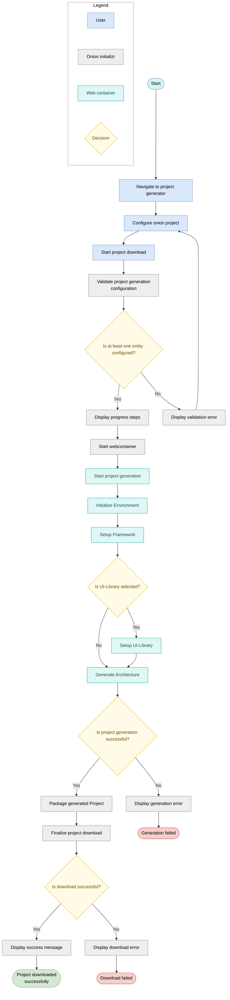

```mermaid
flowchart TD
    %% Legend
    subgraph Legend[" Legend "]
        direction TB
        legendUser["User"]
        legendOnion["Onion initializr"]
        legendWeb["Web container"]
        legendDecision{"Decision"}
        legendUser ~~~ legendOnion ~~~ legendWeb ~~~ legendDecision
    end

    start([Start])
    navigate["Navigate to project generator"]
    configure["Configure onion project"]
    downloadStart["Start project download"]
    validate["Validate project generation<br/>configuration"]
    entities{"Is at least one entity configured?"}
    progress["Display progress steps"]
    validationError["Display validation error"]
    startWeb["Start webcontainer"]
    projectGeneration["Start project generation"]
    initialize["Initialize Environment"]
    framework["Setup Framework"]
    uiSelected{"Is UI-Library selected?"}
    setupUI["Setup UI-Library"]
    architecture["Generate Architecture"]
    generationSuccessful{"Is project generation successful?"}
    package["Package generated Project"]
    finalize["Finalize project download"]
    generationError["Display generation error"]
    generationFailed([Generation failed])
    downloadSuccessful{"Is download successful?"}
    successMessage["Display success message"]
    downloadError["Display download error"]
    downloaded([Project downloaded<br/>successfully])
    downloadFailed([Download failed])
    %% Main flow
    start --> navigate
    navigate --> configure
    configure --> downloadStart
    downloadStart --> validate
    validate --> entities
    entities -->|Yes| progress
    entities -->|No| validationError
    validationError --> configure
    progress --> startWeb
    startWeb --> projectGeneration
    projectGeneration --> initialize
    initialize --> framework
    framework --> uiSelected
    uiSelected -->|Yes| setupUI
    uiSelected -->|No| architecture
    setupUI --> architecture
    architecture --> generationSuccessful
    generationSuccessful -->|Yes| package
    generationSuccessful -->|No| generationError
    generationError --> generationFailed
    package --> finalize
    finalize --> downloadSuccessful
    downloadSuccessful -->|Yes| successMessage
    downloadSuccessful -->|No| downloadError
    successMessage --> downloaded
    downloadError --> downloadFailed
    %% Styling
    classDef process fill:#d9e8fb,stroke:#6c8ebf,color:#000;
    classDef technical fill:#e0f7f5,stroke:#00a99d,color:#155;
    classDef validation fill:#eeeeee,stroke:#888,color:#000;
    classDef decision fill:#fffbe6,stroke:#e6b800,color:#754c00;
    classDef success fill:#d5e8d4,stroke:#82b366,color:#000;
    classDef failure fill:#f8cecc,stroke:#b85450,color:#000;
    classDef startEnd fill:#d5f5f5,stroke:#6c8ebf,color:#000;
    class navigate,configure,downloadStart process;
    class validate,progress,startWeb,validationError,generationError,package,finalize,successMessage,downloadError validation;
    class projectGeneration,initialize,framework,setupUI,architecture technical;
    class entities,uiSelected,generationSuccessful,downloadSuccessful decision;
    class start startEnd;
    class generationFailed,downloadFailed failure;
    class downloaded success;
    %% Legend styling
    class legendUser process;
    class legendOnion validation;
    class legendWeb technical;
    class legendDecision decision;
    style Legend fill:#ffffff,stroke:#999,color:#000;
```
