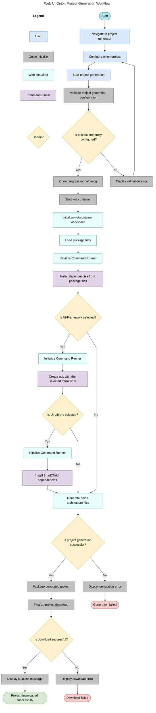

```mermaid
---
title: Web UI Onion Project Generation Workflow
config:
  flowchart:
    rankSpacing: 40
    nodeSpacing: 40
    curve: linear
---
flowchart TD

    %% ============ LEGEND (vertikal, links, ohne Subgraph) ============
    LT["Legend"]
    L1["User"]
    L2["Onion initializr"]
    L3["Web container"]
    L4["Command runner"]
    L5{"Decision"}
    LT ~~~ L1 ~~~ L2 ~~~ L3 ~~~ L4 ~~~ L5

    %% ============ WORKFLOW ============
    START(["Start"])
    A["Navigate to project generator"]
    B["Configure onion project"]
    C["Start project generation"]
    D["Validate project generation configuration"]
    E{"Is at least one entity configured?"}
    F["Display validation error"]

    G["Open progress modaldialog"]
    H["Start webcontainer"]
    I["Initialize webcontainer workspace"]
    J["Load package files"]
    J2["Initialize Command Runner"]
    J3["Install dependencies from package files"]

    K{"Is UI-Framework selected?"}
    L["Initialize Command Runner"]
    N["Create app with the selected framework"]

    O{"Is UI-Library selected?"}
    P["Initialize Command Runner"]
    Q["Install ShadCN/UI dependencies"]

    R["Generate onion architecture files"]
    S{"Is project generation successful?"}
    T["Display generation error"]
    U(["Generation failed"])

    V["Package generated project"]
    W["Finalize project download"]
    X{"Is download successful?"}
    Y["Display success message"]
    Z(["Project downloaded successfully"])
    AA["Display download error"]
    AB(["Download failed"])

    START --> A
    A --> B
    B --> C
    C --> D
    D --> E
    E -- "Yes" --> G
    E -- "No" --> F
    F --> B

    G --> H
    H --> I
    I --> J
    J --> J2
    J2 --> J3
    J3 --> K

    K -- "Yes" --> L
    K -- "No" --> R
    L --> N
    N --> O
    O -- "Yes" --> P
    O -- "No" --> R
    P --> Q
    Q --> R

    R --> S
    S -- "Yes" --> V
    S -- "No" --> T
    T --> U

    V --> W
    W --> X
    X -- "Yes" --> Y
    X -- "No" --> AA
    Y --> Z
    AA --> AB

    %% ============ STYLES ============
    classDef user fill:#dae8fc,stroke:#6c8ebf,color:#000
    classDef initializr fill:#c0c0c0,stroke:#666666,color:#000
    classDef webcontainer fill:#e6fffa,stroke:#3aada8,color:#000
    classDef runner fill:#e1d5e7,stroke:#9673a6,color:#000
    classDef decision fill:#fff2cc,stroke:#d6b656,color:#000
    classDef startNode fill:#b0e3e6,stroke:#0e8088,color:#000
    classDef successNode fill:#d5e8d4,stroke:#82b366,color:#000
    classDef errorNode fill:#f8cecc,stroke:#b85450,color:#000
    classDef legendTitle fill:none,stroke:none,color:#000,font-weight:bold

    class L1,A,B,C user
    class L2,D,F,G,H,T,V,W,Y,AA initializr
    class L3,I,J,J2,L,P,R webcontainer
    class L4,J3,N,Q runner
    class L5,E,K,O,S,X decision
    class START startNode
    class Z successNode
    class U,AB errorNode
    class LT legendTitle
```
